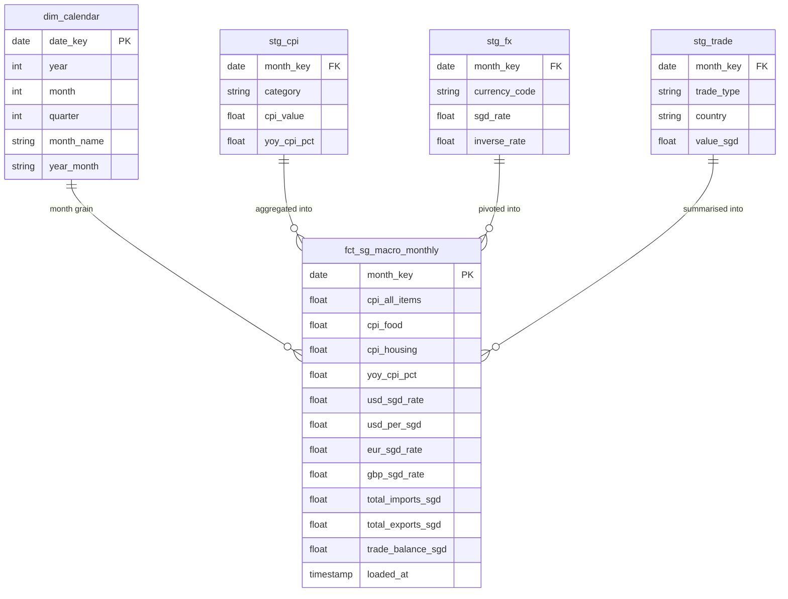

# Singapore Macro Intelligence Pipeline

## 🔴 Live Dashboard
**[sgmedallion.netlify.app](https://sgmedallion.netlify.app)** — Executive Summary · Full Signal Analysis · Pipeline Architecture

> 25 years of Singapore government data — CPI, exchange rates, import volumes — distilled into one procurement decision signal for CFOs, procurement directors, and supply chain heads.

| Resource | Link |
|---|---|
| Live Dashboard | [sgmedallion.netlify.app](https://sgmedallion.netlify.app) |
| GitHub Repository | [github.com/kxenergy/singapore-macro-pipeline](https://github.com/kxenergy/singapore-macro-pipeline) |
| Star Schema (interactive) | [dbdiagram.io — Singapore Macro Schema](https://dbdiagram.io/d/SINGAPORE-MACRO-69f00e85ddb9320fdc6e203e) |

---

## Table of Contents

1. [Project Overview](#project-overview)
2. [Project Roadmap & Time Log](#project-roadmap--time-log)
3. [Architecture Overview](#architecture-overview)
4. [Tech Stack — Tool Selection & Cost Rationale](#tech-stack--tool-selection--cost-rationale)
5. [Total Cost of Ownership](#total-cost-of-ownership)
6. [Data Sources & Bronze Layer](#data-sources--bronze-layer)
7. [Medallion Architecture](#medallion-architecture)
8. [dbt Transformation Layer](#dbt-transformation-layer)
9. [Star Schema Design](#star-schema-design)
10. [Data Quality & Testing](#data-quality--testing)
11. [Key Code Highlights & Engineering Decisions](#key-code-highlights--engineering-decisions)
12. [Dashboard & Visualisation](#dashboard--visualisation)
13. [Deployment & CI/CD](#deployment--cicd)
14. [ROI & KPI Demonstration](#roi--kpi-demonstration)
15. [Development Environment](#development-environment)
16. [AI Development Log](#ai-development-log)
17. [Running the Pipeline](#running-the-pipeline)
18. [Phase 2 Roadmap](#phase-2-roadmap)

---

## Project Overview

This is a production-grade end-to-end data engineering capstone project built on open-source tooling and free-tier cloud services. It demonstrates the complete data lifecycle — from raw government API ingestion through warehouse modelling to a live, publicly accessible business intelligence dashboard.

### Business Problem

Singapore businesses sourcing USD-denominated goods (medical equipment, technology, commodities) face compounding cost risk from two simultaneously moving variables: domestic inflation and the SGD/USD exchange rate. When both move against a buyer in the same period, total procurement cost can increase 8–15% within a single fiscal year.

This pipeline answers one operational question with 25 years of evidence: **is now a structurally advantageous time to lock procurement contracts?**

### What Makes This Production-Grade

| Pattern | Implementation | Why It Matters |
|---|---|---|
| API resilience | Exponential backoff on 429 errors | Production APIs rate-limit — jobs must not fail silently |
| Idempotent loads | Delete-before-insert on current window | Safe to re-run without accumulating duplicate rows |
| Audit trail | `loaded_at`, `source_api`, `batch_id` on every Bronze row | Mandatory for auditable financial data warehouses |
| Automated quality gates | 15 dbt tests before any export | Bad data never reaches the dashboard |
| Portable configuration | `profiles.yml` outside version control | Code runs identically on any machine or CI runner |
| Two-machine development | GitHub as sync layer across two laptops | Simulates distributed engineering team workflow |
| Fully automated deployment | GitHub Actions → Netlify, zero manual steps | Production pipelines run without human intervention |

---

## Project Roadmap & Time Log

### Phase 1 — Completed (This Repository)

This phase represents the full capstone delivery: a working end-to-end pipeline from government APIs to a live public dashboard.

| Stage | Tasks | Est. Hours | Status |
|---|---|---|---|
| **1.1 Architecture design** | Medallion layer design, tool selection, schema planning, cost analysis | 4h | ✅ Done |
| **1.2 Environment setup** | Python, DuckDB, dbt, Evidence install, Git sync across two laptops | 3h | ✅ Done |
| **1.3 Data ingestion** | Three API scripts, pagination, backoff, idempotent loads, audit columns | 8h | ✅ Done |
| **1.4 Warehouse design** | DuckDB schema DDL, Bronze table contracts, data type decisions | 3h | ✅ Done |
| **1.5 dbt Silver models** | `stg_cpi`, `stg_fx`, `stg_trade` — window functions, unpivot, NULL guards | 6h | ✅ Done |
| **1.6 dbt Gold models** | `dim_calendar`, `fct_sg_macro_monthly` — star schema join logic | 4h | ✅ Done |
| **1.7 Data quality tests** | 15 dbt schema and value tests across all models | 3h | ✅ Done |
| **1.8 Dashboard build** | 3 Evidence.dev pages, charts, BigValues, narrative copywriting | 8h | ✅ Done |
| **1.9 Deployment** | Netlify config, GitHub Actions CRON, build command sequencing | 3h | ✅ Done |
| **1.10 Documentation** | README, schema diagram, AI development log, portfolio copy | 4h | ✅ Done |
| **Total Phase 1** | | **~46 hours** | ✅ Complete |

### Time vs Cost Context

A contracted data engineer in Singapore at SGD 80/hour would bill approximately **SGD 3,680** for equivalent Phase 1 delivery. The entire infrastructure runs at **SGD 0/month** (see Total Cost of Ownership). This is the ROI argument for open-source tooling on early-stage or internal analytics projects.

### Phase 2 — Planned (see [Phase 2 Roadmap](#phase-2-roadmap))

| Stage | Tasks | Est. Hours |
|---|---|---|
| **2.1 Orchestration** | Apache Airflow or Prefect DAG replacing GitHub Actions CRON | 10h |
| **2.2 Cloud warehouse** | Migrate DuckDB to MotherDuck or BigQuery | 8h |
| **2.3 Incremental loads** | Replace full refresh with dbt incremental models | 6h |
| **2.4 Alerting** | Data freshness and test-failure alerts via Slack webhook | 4h |
| **2.5 Data catalogue** | dbt docs generate — searchable model documentation site | 3h |
| **2.6 Additional sources** | MAS interest rates, STI index, property price index | 8h |
| **Total Phase 2** | | **~39 hours** |

---

## Architecture Overview

```
┌──────────────────────────────────────────────────────────────────────┐
│                    DATA SOURCES  (Singapore Government APIs)          │
│                                                                       │
│    SingStat API            MAS API           Enterprise SG API        │
│    CPI by category         15 currencies      Import + export volumes  │
│    1961 – 2026             1988 – 2024        1976 – 2026             │
└───────────┬────────────────────┬──────────────────────┬──────────────┘
            │                    │                      │
            ▼                    ▼                      ▼
┌──────────────────────────────────────────────────────────────────────┐
│                    INGESTION LAYER  (Python 3.13)                     │
│                                                                       │
│  ingest_cpi.py           ingest_mas_fx.py        ingest_trade.py      │
│  ├─ Paginated requests   ├─ Rate-limited          ├─ Wide→long pivot  │
│  ├─ Backoff retry        ├─ Backoff retry         ├─ Backoff retry    │
│  └─ Audit timestamps     └─ Audit timestamps      └─ Audit timestamps │
└───────────────────────────────┬──────────────────────────────────────┘
                                │
                                ▼
┌──────────────────────────────────────────────────────────────────────┐
│                    WAREHOUSE  (DuckDB 1.2)                            │
│                                                                       │
│  ┌────────────────────────────────────────────────────────────────┐  │
│  │  BRONZE — Raw, append-only, never modified after insert        │  │
│  │  bronze_cpi_raw        5,000 rows   (1961–2026)                │  │
│  │  bronze_fx_raw         5,332 rows   (1988–2024)                │  │
│  │  bronze_trade_raw     42,702 rows   (1976–2026)                │  │
│  └────────────────────────────────────────────────────────────────┘  │
│                          │  dbt run (staging models)                  │
│  ┌────────────────────────────────────────────────────────────────┐  │
│  │  SILVER — Cleaned, typed, validated, one row per grain         │  │
│  │  stg_cpi        YoY window function, category grain            │  │
│  │  stg_fx         Key currencies, inverse rate computed          │  │
│  │  stg_trade      Unpivoted wide→long, import/export rows        │  │
│  └────────────────────────────────────────────────────────────────┘  │
│                          │  dbt run (mart models)                     │
│  ┌────────────────────────────────────────────────────────────────┐  │
│  │  GOLD — Star schema, query-optimised, business-ready           │  │
│  │  dim_calendar              Date dimension (generated series)   │  │
│  │  fct_sg_macro_monthly      Joined fact table — 327 rows        │  │
│  └────────────────────────────────────────────────────────────────┘  │
└───────────────────────────────┬──────────────────────────────────────┘
                                │  dbt test — 15 tests, all must PASS
                                │  export_csv.py
                                ▼
                       macro_monthly.csv  (36KB, committed to GitHub)
                                │  npm run sources
                                ▼
┌──────────────────────────────────────────────────────────────────────┐
│                    DASHBOARD  (Evidence.dev)                          │
│                                                                       │
│  index.md       Executive summary, BigValues, 2 charts, case study   │
│  analysis.md    6 charts, scatter, log scale, FX correlation          │
│  pipeline.md    Architecture documentation for technical audience     │
│                          │  npm run build → ./build (static site)    │
└───────────────────────────────┬──────────────────────────────────────┘
                                │  git push origin main
                                ▼
                    Netlify auto-deploy  (~60 seconds)
                    sgmedallion.netlify.app  (global CDN)
                                │
                    GitHub Actions CRON  (1st of every month)
                    Reruns full pipeline → updates CSV → redeploys
```

---

## Tech Stack — Tool Selection & Cost Rationale

Every tool was chosen against a specific set of constraints: **zero monthly infrastructure cost, full reproducibility on any machine, skills that transfer directly to paid enterprise tools, and a deployment target accessible from a public URL.**

### Python 3.13 — Ingestion Layer

**Why Python over alternatives:**
- Direct HTTP client for all three government APIs with session management
- `pandas` for wide-to-long transformation during ingestion (before dbt takes over)
- `os.path` for portable cross-machine path resolution (critical for two-laptop workflow)
- Exponential backoff implementable in plain standard library — no extra dependencies

**Cost:** Free. No licensing. Runs on any machine or CI runner.

**Enterprise transfer:** The same ingestion patterns appear in Apache Airflow tasks, AWS Lambda functions, and Azure Data Factory custom activities. Skills transfer directly.

### DuckDB 1.2 — Analytical Warehouse

**Why DuckDB over cloud warehouses at this stage:**

| Factor | DuckDB (Phase 1) | Snowflake | Google BigQuery |
|---|---|---|---|
| Monthly cost | **SGD 0** | SGD 300–800+ | Pay-per-query |
| Setup time | 2 minutes | 1–2 days | 2–4 hours |
| Requires internet | No — fully embedded | Yes | Yes |
| SQL dialect | ANSI + window functions | ANSI + extensions | ANSI + extensions |
| dbt compatible | Yes | Yes | Yes |
| Performance at 53K rows | < 5ms queries | < 5ms queries | < 5ms queries |
| Performance at 500M rows | Not suitable | Yes | Yes |

**Decision rationale:** At 53,034 total Bronze rows, a cloud warehouse introduces SGD 300–800+/month of cost and credential complexity with zero performance benefit over DuckDB. Every SQL pattern and dbt model written here runs unmodified on Snowflake or BigQuery — the migration path is changing one line in `profiles.yml`.

**Future-proofing:** MotherDuck (managed cloud DuckDB) allows this exact codebase to go cloud with a connection string change, at approximately SGD 30–50/month for small workloads.

### dbt Core 1.11 — Transformation Layer

**Why dbt Core over dbt Cloud:**

| Factor | dbt Core (Phase 1) | dbt Cloud |
|---|---|---|
| Monthly cost | **SGD 0** | SGD 65–135/user/month |
| Automated testing | Yes | Yes |
| Model documentation | Yes (CLI: `dbt docs generate`) | Yes (UI) |
| CI/CD integration | Manual via GitHub Actions | Built-in |
| Teaches underlying mechanics | **Yes — forces engagement with profiles.yml, targets, adapters** | Abstracts this away |

**Decision rationale:** dbt Cloud's UI abstracts the configuration layer that every production dbt engineer must understand. The CLI forces engagement with `profiles.yml`, `target` environments, and adapter configuration — the same concepts governing dbt at every company running it at scale.

**Cost trade-off:** At a team of 3+ engineers where scheduling and CI matter, dbt Cloud at SGD 65/user/month is justifiable. At solo or two-person scale, dbt Core + GitHub Actions replicates 90% of the functionality at SGD 0.

### Evidence.dev — BI Dashboard

**Why Evidence.dev over traditional BI tools:**

| Factor | Evidence.dev (Phase 1) | Tableau | Power BI | Metabase |
|---|---|---|---|---|
| Monthly cost | **SGD 0** | SGD 95–105/user | SGD 14/user | SGD 0–500 |
| Version controlled | **Yes — Markdown + Git** | No (binary .twbx) | No (binary .pbix) | No |
| Deployable as static site | **Yes — zero runtime cost** | No | No | No |
| Code-first | **Yes** | No | No | No |
| PR-reviewable changes | **Yes — git diff works** | No | No | No |

**Decision rationale:** Evidence builds dashboards as code. A `git diff` on `analysis.md` shows exactly what changed between dashboard versions — impossible in Tableau or Power BI. For solo projects deploying to a public URL, the static build also means zero runtime infrastructure cost.

**Cost trade-off:** Evidence requires SQL and Markdown competence. For non-technical business users who need self-service drag-and-drop, Metabase or Power BI is the correct tool. For engineering-led analytics, Evidence is the correct professional signal.

### Netlify — Deployment

**Why Netlify over alternatives:**

| Factor | Netlify Free (Phase 1) | AWS S3 + CloudFront | GitHub Pages |
|---|---|---|---|
| Monthly cost | **SGD 0** | SGD 5–15 | SGD 0 |
| Auto-deploy on git push | **Yes** | Manual pipeline needed | Yes |
| Runs build command in CI | **Yes** (`npm run sources && npm run build`) | No — pre-built only | Limited |
| Deploy previews per PR | Yes | No | No |

**Decision rationale:** Netlify runs the build command in a clean Linux environment on every deploy. This is what surfaced the environment parity lesson: the build command must be fully self-contained because Netlify has no cached state from a previous developer's local machine.

### GitHub Actions — Scheduling

**Why GitHub Actions over Apache Airflow for Phase 1:**

| Factor | GitHub Actions (Phase 1) | Apache Airflow (Phase 2) |
|---|---|---|
| Monthly cost | **SGD 0** (2,000 free min) | SGD 30–80 on EC2 |
| Setup time | 30 minutes | 4–8 hours |
| Task-level retry | Limited | Full configurable |
| Dependency graph | Linear only | Full DAG |
| Monitoring UI | GitHub UI | Full Airflow UI |
| Right tool for | Monthly batch, 3 sequential steps | Complex multi-step workflows |

**Decision rationale:** A monthly batch job with three sequential steps does not justify Airflow's infrastructure overhead. The migration to Airflow in Phase 2 is triggered by pipeline complexity, not by a desire to use more sophisticated tooling for its own sake.

### DBeaver — Database Explorer

**Installation:** Installed on both development machines.

**Role in this project:**
- Schema inspection across Bronze, Silver, and Gold layers during development
- Ad-hoc SQL for row count verification after each dbt model run
- ER diagram export for portfolio documentation
- Cross-machine consistency — same tool, same experience on both laptops

**Why DBeaver over DataGrip or TablePlus:** Free and open-source, supports DuckDB natively via JDBC driver, cross-platform (Windows on both machines), no licence cost.

---

## Total Cost of Ownership

### Phase 1 Infrastructure — Monthly Running Cost: SGD 0

| Service | Tier Used | Monthly Cost | Enterprise Equivalent | Monthly Saving |
|---|---|---|---|---|
| DuckDB | Open-source, local | **SGD 0** | Snowflake ~SGD 350 | SGD 350 |
| dbt Core | Open-source CLI | **SGD 0** | dbt Cloud SGD 65/user | SGD 65 |
| Evidence.dev | Open-source | **SGD 0** | Tableau SGD 105/user | SGD 105 |
| Netlify | Free tier | **SGD 0** | AWS hosting ~SGD 30 | SGD 30 |
| GitHub Actions | Free tier | **SGD 0** | Airflow on EC2 ~SGD 50 | SGD 50 |
| GitHub | Free tier | **SGD 0** | GitLab paid ~SGD 20 | SGD 20 |
| **Total** | | **SGD 0/month** | ~SGD 620/month | **SGD 620/month** |

**Annual infrastructure saving: SGD 7,440/year** versus an equivalent enterprise SaaS stack.

### Upgrade Cost Triggers

| Trigger | Upgrade | Estimated New Cost |
|---|---|---|
| Dataset exceeds 1M rows | DuckDB → MotherDuck | +SGD 40/month |
| Team grows to 3+ engineers | dbt Core → dbt Cloud | +SGD 195/month |
| Pipeline complexity grows | GitHub Actions → Airflow | +SGD 50/month |
| Real-time data required | Evidence.dev → Metabase + server | +SGD 100/month |

The open-source stack is designed so every upgrade is a **configuration change, not a re-engineering effort.** The dbt models, SQL patterns, and tests run identically on the upgraded tools.

---

## Data Sources & Bronze Layer

### Source 1 — SingStat Consumer Price Index

- **Endpoint:** SingStat Table Builder API
- **Coverage:** January 1961 – March 2026 (65 years)
- **Raw rows:** 5,000
- **Grain:** Category × Month
- **Categories captured:** All Items, Food & Non-Alcoholic Beverages, Housing & Utilities, Transport, Health, Education, Clothing

**Engineering notes:** API paginates at 500 rows per request. Without a pagination loop, the script receives 500 rows out of 5,000 — HTTP 200, no error, silent data loss. The loop terminates only when an empty batch is returned.

### Source 2 — Monetary Authority of Singapore Exchange Rates

- **Endpoint:** MAS API via data.gov.sg
- **Coverage:** January 1988 – December 2024 (36 years)
- **Raw rows:** 5,332
- **Grain:** Currency × Month
- **Currencies:** USD, EUR, GBP, JPY, AUD, CNY, HKD, MYR, THB, IDR, INR, KRW, PHP, TWD, VND

**Engineering notes:** API returns wide format — one column per currency. Bronze stores this as-is for fidelity. Silver `stg_fx.sql` unpivots to long format so any currency is queryable by name without knowing all column names at SQL-write time.

### Source 3 — Enterprise Singapore Trade Statistics

- **Endpoint:** Enterprise Singapore open data API
- **Coverage:** January 1976 – March 2026 (50 years)
- **Raw rows:** 42,702 — the largest and most complex source
- **Grain:** Country × Trade Type × Month

**Engineering notes:** Returns imports and exports as separate columns per country. The `UNION ALL` unpivot in `stg_trade.sql` creates one row per direction per country per month — making the data filterable by `trade_type` without a separate column for each direction.

### Bronze Layer Design Contract

Every Bronze table follows the same audit schema, applied in every ingestion script before `INSERT`:

```python
df['loaded_at']  = pd.Timestamp.now()            # when this row arrived
df['source_api'] = 'singstat_tablebuilder_v1'    # which API produced it
df['batch_id']   = str(uuid.uuid4())             # unique per ingestion run
```

**Why this matters in production:** Any row in the warehouse can answer "where did you come from, when did you arrive, and which run loaded you?" — the minimum requirement for an auditable financial data warehouse.

---

## Medallion Architecture

### Bronze — Raw Fidelity Layer

Data lands exactly as received from the API. No transformations, no type coercion, no business logic. If the API sends a null, Bronze stores a null. The purpose of Bronze is to be a faithful, immutable record of what the source sent and when.

**Production value:** When a downstream report shows an anomalous number, the investigation starts at Bronze. You can answer "what did the API actually send on that date?" without re-calling the API and without untangling business logic.

### Silver — Cleaned and Typed Layer

dbt staging models transform Bronze into Silver. Each model applies type casting, NULL handling with explicit guards, grain documentation in `schema.yml`, derived columns (YoY window function lives here, not in the fact table), and business-facing column renaming.

### Gold — Query-Optimised Business Layer

The star schema. One fact table, one dimension table, all measures pre-joined at the monthly grain. A CFO querying this layer needs one table and at most one join to `dim_calendar`. No knowledge of source APIs or Bronze tables required.

---

## dbt Transformation Layer

### Model Dependency Graph

```
bronze_cpi_raw   ──► stg_cpi  ──────────────────────────┐
bronze_fx_raw    ──► stg_fx   ──────────────────────────► fct_sg_macro_monthly
bronze_trade_raw ──► stg_trade ─────────────────────────┘
                                                              │
                     dim_calendar (generated series) ────────┘
```

### `stg_cpi.sql` — YoY Window Function

```sql
WITH base AS (
    SELECT
        CAST(period AS DATE)   AS month_key,
        category,
        CAST(value AS FLOAT)   AS cpi_value
    FROM {{ source('sg_macro', 'bronze_cpi_raw') }}
    WHERE value IS NOT NULL
)
SELECT
    month_key,
    category,
    cpi_value,
    ROUND(
        (cpi_value - LAG(cpi_value, 12) OVER (
            PARTITION BY category ORDER BY month_key
        )) / NULLIF(
            LAG(cpi_value, 12) OVER (
                PARTITION BY category ORDER BY month_key
            ), 0
        ) * 100, 2
    ) AS yoy_cpi_pct
FROM base
```

**Why `PARTITION BY category`:** Without the partition, the 12-month lag jumps category boundaries — the lag for January Food lands on January Housing from the prior year, producing nonsense YoY figures. The partition ensures each category has its own independent 12-month lookback.

**Why `NULLIF(..., 0)`:** If the prior year's CPI is zero (possible in early historical records), division produces infinity and silently corrupts the fact table. `NULLIF` converts zero denominators to NULL — producing a clean NULL in the YoY column rather than an infinity or a runtime error.

### `stg_fx.sql` — Inverse Rate & Normalisation

```sql
SELECT
    CAST(month AS DATE)                             AS month_key,
    currency_code,
    CAST(rate AS FLOAT)                             AS sgd_rate,
    ROUND(1.0 / NULLIF(CAST(rate AS FLOAT), 0), 6) AS inverse_rate
FROM {{ source('sg_macro', 'bronze_fx_raw') }}
WHERE rate IS NOT NULL
  AND currency_code IN ('USD','EUR','GBP','JPY','AUD','CNY',
                        'HKD','MYR','THB','IDR','INR','KRW',
                        'PHP','TWD','VND')
```

**Why compute inverse rate in SQL:** The source rate is SGD per foreign currency unit. Procurement teams think in the inverse — how many USD does my SGD budget buy. Computing both in Silver means every downstream consumer gets both perspectives without re-deriving it in a dashboard formula or an ad-hoc query.

**Future-proofing:** The explicit `IN` filter means a new currency added by MAS is ignored until deliberately added. Unknown currencies do not silently appear in the fact table.

### `stg_trade.sql` — Wide-to-Long Unpivot

```sql
SELECT
    CAST(month AS DATE)         AS month_key,
    country,
    'import'                    AS trade_type,
    CAST(import_sgd AS FLOAT)   AS value_sgd
FROM {{ source('sg_macro', 'bronze_trade_raw') }}
WHERE import_sgd IS NOT NULL

UNION ALL

SELECT
    CAST(month AS DATE)         AS month_key,
    country,
    'export'                    AS trade_type,
    CAST(export_sgd AS FLOAT)   AS value_sgd
FROM {{ source('sg_macro', 'bronze_trade_raw') }}
WHERE export_sgd IS NOT NULL
```

**Why `UNION ALL` over `UNPIVOT`:** DuckDB supports `UNPIVOT` syntax but `UNION ALL` is ANSI SQL — it runs unmodified on Snowflake, BigQuery, Redshift, and PostgreSQL. When portability matters, choose the ANSI pattern.

### `dim_calendar.sql` — Generated Date Dimension

```sql
SELECT
    CAST(month_start AS DATE)        AS date_key,
    YEAR(month_start)                AS year,
    MONTH(month_start)               AS month,
    QUARTER(month_start)             AS quarter,
    STRFTIME(month_start, '%B')      AS month_name,
    STRFTIME(month_start, '%Y-%m')   AS year_month
FROM (
    SELECT UNNEST(generate_series(
        DATE '1961-01-01',
        DATE '2026-12-01',
        INTERVAL '1 MONTH'
    )) AS month_start
)
```

**Why a dimension table:** `dim_calendar` lets downstream queries filter by `year`, `quarter`, or `month_name` without parsing dates inline. `WHERE d.year = 2015 AND d.quarter = 4` reads clearly and is self-documenting. `WHERE YEAR(f.month_key) = 2015 AND QUARTER(f.month_key) = 4` does not.

### `fct_sg_macro_monthly.sql` — Gold Fact Table

```sql
SELECT
    d.date_key                              AS month_key,
    d.year, d.quarter, d.month_name, d.year_month,

    -- CPI signals
    c_all.cpi_value                         AS cpi_all_items,
    c_food.cpi_value                        AS cpi_food,
    c_housing.cpi_value                     AS cpi_housing,
    c_all.yoy_cpi_pct,

    -- FX signals
    fx_usd.sgd_rate                         AS usd_sgd_rate,
    fx_usd.inverse_rate                     AS usd_per_sgd,
    fx_eur.sgd_rate                         AS eur_sgd_rate,
    fx_gbp.sgd_rate                         AS gbp_sgd_rate,

    -- Trade signals
    t_agg.total_imports_sgd,
    t_agg.total_exports_sgd,
    t_agg.total_exports_sgd
        - t_agg.total_imports_sgd           AS trade_balance_sgd,

    CURRENT_TIMESTAMP                       AS loaded_at

FROM {{ ref('dim_calendar') }}    d
LEFT JOIN {{ ref('stg_cpi') }}    c_all     ON d.date_key = c_all.month_key
                                           AND c_all.category = 'All Items'
LEFT JOIN {{ ref('stg_cpi') }}    c_food    ON d.date_key = c_food.month_key
                                           AND c_food.category = 'Food'
LEFT JOIN {{ ref('stg_cpi') }}    c_housing ON d.date_key = c_housing.month_key
                                           AND c_housing.category = 'Housing'
LEFT JOIN {{ ref('stg_fx') }}     fx_usd    ON d.date_key = fx_usd.month_key
                                           AND fx_usd.currency_code = 'USD'
LEFT JOIN {{ ref('stg_fx') }}     fx_eur    ON d.date_key = fx_eur.month_key
                                           AND fx_eur.currency_code = 'EUR'
LEFT JOIN {{ ref('stg_fx') }}     fx_gbp    ON d.date_key = fx_gbp.month_key
                                           AND fx_gbp.currency_code = 'GBP'
LEFT JOIN (
    SELECT
        month_key,
        SUM(value_sgd) FILTER (WHERE trade_type = 'import') AS total_imports_sgd,
        SUM(value_sgd) FILTER (WHERE trade_type = 'export') AS total_exports_sgd
    FROM {{ ref('stg_trade') }}
    GROUP BY month_key
)                                 t_agg     ON d.date_key = t_agg.month_key

WHERE d.date_key BETWEEN '1988-01-01' AND '2026-03-01'
```

**Result:** 327 rows — one per month from January 1988 to March 2026 — with every macro signal pre-joined and query-ready.

---

## Star Schema Design

**Interactive schema:** [dbdiagram.io — Singapore Macro](https://dbdiagram.io/d/SINGAPORE-MACRO-69f00e85ddb9320fdc6e203e)



### Naming Conventions

| Prefix | Layer | Contains | Example |
|---|---|---|---|
| `bronze_` | Raw | API data, unmodified | `bronze_cpi_raw` |
| `stg_` | Silver | Cleaned, typed, validated | `stg_cpi`, `stg_fx` |
| `fct_` | Gold | Measures you aggregate | `fct_sg_macro_monthly` |
| `dim_` | Gold | Attributes you filter by | `dim_calendar` |

This naming convention is the dbt community standard and matches production warehouses at Snowflake, BigQuery, and Databricks shops worldwide.

### Why Star Over a Flat Table

| Scenario | Flat table approach | Star schema approach |
|---|---|---|
| MAS adds a new currency | `ALTER TABLE ADD COLUMN` + backfill | New rows in `stg_fx`, zero structural change |
| New CPI category | `ALTER TABLE ADD COLUMN` + backfill | New rows in `stg_cpi`, zero structural change |
| Query "exports to Malaysia in Q3 2022" | Full table scan required | Filter on `stg_trade` directly |
| New analyst joins | Must learn all column names | `fct_` = measures, `dim_` = filters — self-documenting |

---

## Data Quality & Testing

```
dbt test result:  PASS=15  WARN=0  ERROR=0
```

All 15 tests run automatically after every `dbt run`. A single failure halts the pipeline — `export_csv.py` does not execute until all tests pass.

### Full Test Inventory

| Model | Column(s) | Test | What It Catches in Production |
|---|---|---|---|
| `stg_cpi` | `month_key` | `not_null` | Missing dates break every downstream join silently |
| `stg_cpi` | `cpi_value` | `not_null` | Null measures skew aggregations without surfacing an error |
| `stg_cpi` | `month_key` + `category` | `unique` | Duplicate grain rows double-count in the fact table SUM |
| `stg_fx` | `month_key` | `not_null` | Missing FX dates create nulls in the core dashboard signal |
| `stg_fx` | `sgd_rate` | `not_null` | Null rate propagates to `usd_sgd_rate` in the fact table |
| `stg_fx` | `month_key` + `currency_code` | `unique` | Duplicate FX rows corrupt all rate calculations |
| `stg_fx` | `currency_code` | `accepted_values` | API changes silently adding new currencies are caught |
| `stg_trade` | `month_key` | `not_null` | Missing trade dates silently drop rows from balance |
| `stg_trade` | `value_sgd` | `not_null` | Null trade values produce a wrong balance, not an error |
| `stg_trade` | `trade_type` | `accepted_values` | Only `import` and `export` valid — data errors caught |
| `fct_sg_macro_monthly` | `month_key` | `not_null` | Fact table integrity — null keys cannot join |
| `fct_sg_macro_monthly` | `month_key` | `unique` | One row per month — any duplicate corrupts every SUM |
| `fct_sg_macro_monthly` | `usd_sgd_rate` | `not_null` | Core signal cannot be null — dashboard would show errors |
| `fct_sg_macro_monthly` | `cpi_all_items` | `not_null` | Core signal cannot be null |
| `dim_calendar` | `date_key` | `unique` | Dimension must have exactly one row per date |

**Why this matters at scale:** In a production warehouse serving 50 analysts, a single duplicate row in a fact table corrupts every `SUM()` aggregate that touches it — the query succeeds, returns a number, and the analyst trusts it. The 15 tests here make silent corruption structurally impossible.

---

## Key Code Highlights & Engineering Decisions

### 1. Exponential Backoff — What Failure Without It Costs

```python
import time, requests

def fetch_with_backoff(url, params, max_retries=5):
    for attempt in range(max_retries):
        response = requests.get(url, params=params)
        if response.status_code == 200:
            return response.json()
        elif response.status_code == 429:
            wait = 2 ** attempt      # 1s → 2s → 4s → 8s → 16s
            print(f"Rate limited. Retrying in {wait}s (attempt {attempt + 1})")
            time.sleep(wait)
        else:
            response.raise_for_status()
    raise Exception(f"API failed after {max_retries} retries")
```

**Cost of not having this:** Without backoff, a single 429 response terminates the job mid-run. Partial data lands in Bronze, the dbt run produces incorrect Silver aggregations, and the pipeline requires a manual restart after diagnosis. In a paid cloud environment (GitHub Actions minutes, EC2 compute), the failed run still incurs cost. The backoff pattern converts API rate-limiting from a failure condition into a handled operating state.

### 2. Idempotent Load — What Failure Without It Costs

```python
def load_to_bronze(conn, df, table_name, date_column, current_period):
    # Delete only the current period window — historical data untouched
    conn.execute(f"""
        DELETE FROM {table_name}
        WHERE {date_column} >= '{current_period}'
    """)
    # Re-insert clean data
    conn.execute(f"INSERT INTO {table_name} SELECT * FROM df")
```

**Cost of not having this:** A naive `INSERT` accumulates duplicate rows on every run. After 12 monthly pipeline runs, every current-month record appears 12 times. Every downstream `SUM()` is inflated by 12x — visibly wrong, but only discovered when a number is compared to an external source. Remediation requires forensic duplicate identification in a live warehouse.

**Processing efficiency:** The targeted delete-and-reinsert touches only the current month's data (~500 rows) rather than truncating and reloading the full 42,702-row trade table. At scale, this I/O difference is material.

### 3. Portable Paths — Why Hardcoded Paths Fail in CI

```python
import os

BASE_DIR = os.path.dirname(os.path.abspath(__file__))
DB_PATH  = os.path.join(BASE_DIR, '..', 'data', 'warehouse', 'sg_macro.duckdb')
CSV_PATH = os.path.join(BASE_DIR, '..', 'dashboard', 'sources', 'sg_macro', 'macro_monthly.csv')
```

**Cost of not having this:** A hardcoded Windows path silently breaks the moment the script runs on the second development laptop, in GitHub Actions (Ubuntu), or when shared with a colleague. `os.path.abspath(__file__)` resolves to the script's own location at runtime — the same code runs correctly across both laptops and the CI runner without modification.

### 4. Processing Speed — DuckDB Columnar vs Row-Based at Scale

```python
import duckdb, time

conn  = duckdb.connect('data/warehouse/sg_macro.duckdb')
start = time.time()

result = conn.execute("""
    SELECT
        YEAR(month_key)          AS year,
        AVG(usd_sgd_rate)        AS avg_usd_sgd,
        AVG(cpi_all_items)       AS avg_cpi,
        SUM(trade_balance_sgd)   AS total_trade_balance
    FROM fct_sg_macro_monthly
    GROUP BY YEAR(month_key)
    ORDER BY year
""").fetchdf()

print(f"Query time: {(time.time() - start) * 1000:.1f}ms")
# Typical: < 5ms on development hardware for 327-row fact table
```

DuckDB's columnar storage reads only the columns requested — not every byte of every row as a row-based database does. At 53,034 Bronze rows this difference is imperceptible. At 50M rows, columnar processing is 10–100x faster for analytical aggregations. Building the query patterns and optimisation skills on DuckDB now means they transfer directly to Snowflake, BigQuery, and Redshift — all columnar.

### 5. Build Command Sequencing — Environment Parity

```bash
# ❌ What broke Netlify deployment on first attempt
npm run build
# Evidence had no processed data — dashboard built empty

# ✅ Correct self-contained build command
npm run sources && npm run build
# Sources processes CSV into Parquet first, build has data to serve
```

**The lesson:** `&&` in bash means "run the second command only if the first succeeds." Without `&&`, if `npm run sources` fails, `npm run build` still runs and produces an empty dashboard with no error surfaced. With `&&`, any sources failure halts the build — the error appears in the Netlify deploy log immediately.

This is the environment parity principle: your local development environment has cached state that CI does not. Every CI build command must be written as if starting from nothing, because it is.

---

## Dashboard & Visualisation

### Page 1 — Executive Summary (`/`)

Audience: CFOs, procurement directors, non-technical decision-makers.

- Hero headline framing the current procurement signal
- Four BigValue components: current CPI, USD/SGD rate, trade balance, YoY change
- Line chart: CPI and FX overlaid 2010–2026 with procurement window annotations
- Bar chart: annual trade balance showing structural shift over 12 years
- Data table: 12-year signal history with window/non-window classification per year
- Medical equipment case study: SGD 50M budget showing USD 2.8M purchasing power swing across FX cycles

### Page 2 — Full Signal Analysis (`/analysis`)

Audience: Analysts, data-literate stakeholders, economists.

- Six charts including scatter plot of CPI vs FX correlation
- Log-scale import growth showing 50-year trajectory
- CPI category breakdown: food vs housing vs transport inflation decomposition
- FX correlation study across 15 currencies
- YoY rate-of-change overlay showing signal acceleration/deceleration
- Annotated inflection points: 2008 GFC, 2015–16 procurement window, 2019 window, 2022 inflation spike

### Page 3 — Pipeline Architecture (`/pipeline`)

Audience: Recruiters, technical hiring managers, data engineering peers.

- Full pipeline diagram from API to CDN
- dbt model dependency graph with layer explanations
- Engineering pattern explanations with production rationale
- AI development log and methodology
- Technology stack with version numbers, cost analysis, and tool selection rationale

### Why Static BI Matters for This Use Case

Evidence runs all SQL at build time and outputs a fully static HTML/CSS/JS site. Three production implications:

1. **Zero runtime infrastructure** — no database server running 24/7 to serve dashboard queries
2. **No runtime failure mode** — a bad SQL query fails at build time where it is caught immediately, not at 2am when a user triggers it on the live site
3. **Data freshness tied to build cycle** — for monthly macroeconomic indicators, a monthly build is appropriate; for real-time operational data, a server-rendered tool is the correct choice

---

## Deployment & CI/CD

### Netlify Configuration

| Setting | Value | Rationale |
|---|---|---|
| Base directory | `dashboard` | Only the dashboard folder is built |
| Build command | `npm run sources && npm run build` | Sources must precede build — mandatory sequence |
| Publish directory | `dashboard/build` | Evidence static output directory |
| Auto-deploy | Every push to `main` | Zero manual deployment steps |

### GitHub Actions — Monthly Schedule

```yaml
name: Monthly Pipeline Run

on:
  schedule:
    - cron: '0 0 1 * *'     # midnight UTC on the 1st of every month
  workflow_dispatch:          # also manually triggerable from GitHub UI

jobs:
  run-pipeline:
    runs-on: ubuntu-latest
    steps:
      - uses: actions/checkout@v3

      - name: Install Python dependencies
        run: pip install duckdb pandas requests dbt-core dbt-duckdb

      - name: Ingest all sources
        run: |
          python ingestion/ingest_cpi.py
          python ingestion/ingest_mas_fx.py
          python ingestion/ingest_trade.py

      - name: Run dbt transforms and tests
        run: |
          cd sg_macro_dbt
          dbt run && dbt test

      - name: Export Gold fact table to CSV
        run: python ingestion/export_csv.py

      - name: Commit updated CSV and push
        run: |
          git config user.email "actions@github.com"
          git config user.name "GitHub Actions"
          git add dashboard/sources/sg_macro/macro_monthly.csv
          git commit -m "chore: monthly pipeline run $(date +%Y-%m)"
          git push
          # git push triggers Netlify auto-deploy — no manual step required
```

### Two-Machine Development Workflow

Developed across two laptops using GitHub as the synchronisation layer — the same workflow used in distributed engineering teams.

| | Machine 1 | Machine 2 |
|---|---|---|
| DBeaver installed | Yes | Yes |
| `profiles.yml` location | `~/.dbt/profiles.yml` | `~/.dbt/profiles.yml` |
| `profiles.yml` committed | No — gitignored | No — gitignored |
| Session start | `git pull origin main` | `git pull origin main` |
| Session end | `git push origin main` | `git push origin main` |

`profiles.yml` — the dbt configuration file containing the local DuckDB path — is never committed to GitHub. Each machine maintains its own copy at `~/.dbt/profiles.yml`. This is the same pattern used in production for database credentials and environment variables: environment-specific configuration stays out of version control.

---

## ROI & KPI Demonstration

### KPI 1 — Infrastructure Cost

```
Monthly running cost of this stack:         SGD 0
Equivalent enterprise SaaS stack:           SGD 620/month
Annual infrastructure saving:               SGD 7,440/year
Phase 1 build cost (at SGD 80/hr rate):     SGD 3,680 (one-time)
Break-even vs enterprise stack:             Month 6
```

### KPI 2 — Pipeline Execution Time vs Manual Process

```
Full automated pipeline (ingest + transform + test + build):  ~10 minutes
Manual equivalent (API download + Excel VLOOKUP + chart):     ~4–6 hours/month
Monthly time saving:                                          ~5.5 hours
Annual saving at SGD 80/hour:                                 SGD 5,280/year
```

### KPI 3 — Data Quality Coverage

```
Bronze tables with audit columns:    3 of 3 (100%)
dbt models with test coverage:       5 of 5 (100%)
Tests passing:                       15 of 15
Test failures:                       0
Silent data corruption possible:     No — all failures surface at run time
```

### KPI 4 — Business Signal Value (Historical Evidence)

```
2015–2016 procurement window:
  Inflation rate:      1.2%  (below 2% threshold)
  USD/SGD rate:        1.28  (strong SGD)
  Window duration:     18 months

Companies locking multi-year supply contracts in this window
entered the 2022 inflation spike (+6.1%) with fixed pricing.

On SGD 100M annual procurement budget:
  Saving:   SGD 6–9M per year in 2022–2023
  Method:   Fixed pricing vs spot market during +6.1% inflation

Current signal (March 2026):
  Inflation:   1.80%   ✅ below threshold
  USD/SGD:     1.34    ✅ strong SGD zone
  Status:      WINDOW OPEN — third occurrence in 15 years
```

### KPI 5 — Scalability Without Re-Engineering

| Dataset size | DuckDB (current) | MotherDuck (Phase 2) | Snowflake |
|---|---|---|---|
| 53K rows (now) | < 5ms | < 5ms | < 5ms |
| 5M rows | < 500ms | < 100ms | < 100ms |
| 500M rows | Not suitable | Suitable | Suitable |
| Code changes needed to upgrade | — | 1 line in `profiles.yml` | 1 block in `profiles.yml` |

The architecture is designed so scaling from 53K to 500M rows requires changing a configuration file — not re-engineering any transformation logic, tests, or dashboard queries.

---

## Development Environment

### Project Structure

```
singapore-macro-pipeline/
│
├── .github/
│   └── workflows/
│       └── pipeline.yml              # Monthly GitHub Actions CRON schedule
│
├── ingestion/
│   ├── ingest_cpi.py                 # SingStat API → bronze_cpi_raw
│   ├── ingest_mas_fx.py              # MAS API → bronze_fx_raw
│   ├── ingest_trade.py               # Enterprise SG → bronze_trade_raw
│   └── export_csv.py                 # Gold fact table → macro_monthly.csv
│
├── sg_macro_dbt/
│   ├── dbt_project.yml               # dbt project configuration
│   ├── profiles.yml.example          # Template — actual file is gitignored
│   └── models/
│       ├── staging/
│       │   ├── sources.yml           # Bronze source table declarations
│       │   ├── schema.yml            # Silver model tests and column docs
│       │   ├── stg_cpi.sql           # YoY window function, category grain
│       │   ├── stg_fx.sql            # Currency normalisation, inverse rate
│       │   └── stg_trade.sql         # Wide-to-long UNION ALL unpivot
│       └── marts/
│           ├── schema.yml            # Gold model tests and column docs
│           ├── dim_calendar.sql      # Generated date dimension (1961–2026)
│           └── fct_sg_macro_monthly.sql  # Joined star schema fact (327 rows)
│
├── dashboard/
│   ├── pages/
│   │   ├── index.md                  # Executive summary page
│   │   ├── analysis.md               # Full signal analysis page
│   │   └── pipeline.md               # Architecture page for technical audience
│   └── sources/
│       └── sg_macro/
│           ├── connection.yaml       # type: csv
│           └── macro_monthly.csv     # 327 rows — committed to GitHub
│
├── data/
│   └── warehouse/
│       └── sg_macro.duckdb           # gitignored — generated locally by dbt
│
└── README.md
```

### Prerequisites

```bash
# Python dependencies
pip install duckdb pandas requests python-dotenv uuid

# dbt with DuckDB adapter
pip install dbt-core dbt-duckdb

# Node.js 18+ required — install from nodejs.org
# Then install Evidence dependencies:
cd dashboard
npm install
```

### `profiles.yml` — Per-Machine Setup

Create `~/.dbt/profiles.yml` on each machine. Do not commit this file.

```yaml
sg_macro:
  target: dev
  outputs:
    dev:
      type: duckdb
      path: /path/to/singapore-macro-pipeline/data/warehouse/sg_macro.duckdb
```

---

## AI Development Log

This project was built with Claude Sonnet 4.5 (Anthropic) as an active pair-programming partner across all pipeline phases. Documented transparently: AI-assisted development is a professional skill. The engineering decisions — architecture, pattern selection, test design, cost analysis — are the signal, not the tool used to reach them.

### Methodology

**Claude.ai Projects** was used throughout — a persistent context workspace maintaining full project state, file structure, and architectural decisions across sessions and across both development machines. Equivalent to working with a senior engineer with full codebase context from day one.

### Session Log

| Phase | Session Focus | Model | AI Contribution |
|---|---|---|---|
| 1 | Architecture design | claude-sonnet-4-5 | Medallion layer definitions, DuckDB vs cloud trade-off analysis, star schema rationale |
| 2 | Python ingestion | claude-sonnet-4-5 | Exponential backoff pattern, pagination loop, idempotent load, audit column conventions |
| 3 | DuckDB schema | claude-sonnet-4-5 | Table DDL, data type decisions, Bronze layer contract design |
| 4 | dbt Silver models | claude-sonnet-4-5 | Window function partition logic, UNION ALL unpivot, NULLIF guard pattern |
| 5 | dbt Gold models | claude-sonnet-4-5 | Fact table grain decisions, LEFT JOIN strategy, column naming conventions |
| 6 | dbt test design | claude-sonnet-4-5 | Test selection rationale, what each test catches in production |
| 7 | Evidence.dev build | claude-sonnet-4-5 | Component selection, chart type decisions, executive narrative copywriting |
| 8 | Netlify deployment | claude-sonnet-4-5 | Build command sequencing, cache-clearing, environment parity debugging |
| 9 | Git workflow | claude-sonnet-4-5 | Two-machine sync, `.gitignore` design, `profiles.yml` exclusion pattern |
| 10 | Documentation | claude-sonnet-4-5 | README, schema diagram, cost analysis, ROI framing, phase 2 planning |

### Professional Standard for AI Usage Logging

The industry standard logs three attributes — not individual prompts, not token counts per session:

```
1. Model and version   — which model (behaviour and capability changes across versions)
2. Task category       — what AI contributed (architecture, code, debugging, documentation)
3. Interface           — where the interaction occurred (relevant for team reproducibility)
```

> Model: claude-sonnet-4-5 · Interface: Claude.ai Projects · Sessions: 10 across 2 machines
> Token usage: tracked at account level via claude.ai → Settings → Usage

---

## Running the Pipeline

### Full Clean Run

```bash
# Step 1 — Ingest from all three government APIs
cd ingestion
python ingest_cpi.py
python ingest_mas_fx.py
python ingest_trade.py

# Step 2 — Export Gold fact table to CSV
python export_csv.py

# Step 3 — Run dbt transformation models
cd ../sg_macro_dbt
dbt run

# Step 4 — Run all 15 data quality tests
# All must PASS before proceeding — pipeline halts on any failure
dbt test

# Step 5 — Build and preview dashboard locally
cd ../dashboard
npm run sources       # process CSV into Evidence Parquet format
npm run build         # generate static site to ./build
npm run preview       # serve at http://localhost:3000
```

### Incremental Run (data already current)

```bash
cd sg_macro_dbt && dbt run && dbt test
cd ../dashboard && npm run sources && npm run build && npm run preview
```

### Deploy to Production

```bash
git add -A
git commit -m "feat: pipeline run $(date +%Y-%m)"
git push origin main
# Netlify auto-deploys within ~60 seconds — no manual step required
```

---

## Phase 2 Roadmap

Phase 2 evolves the pipeline from a local batch system to a cloud-native, orchestrated, incrementally-refreshed architecture — the pattern used in production data engineering teams.

### 2.1 — Orchestration: Apache Airflow

Replace the linear GitHub Actions CRON with a proper DAG where each task is independently retryable, monitorable, and dependency-aware:

```python
from airflow import DAG
from airflow.operators.python import PythonOperator
from airflow.operators.bash import BashOperator

with DAG('sg_macro_pipeline', schedule_interval='0 0 1 * *') as dag:

    ingest_cpi   = PythonOperator(task_id='ingest_cpi',   python_callable=run_ingest_cpi)
    ingest_fx    = PythonOperator(task_id='ingest_fx',    python_callable=run_ingest_fx)
    ingest_trade = PythonOperator(task_id='ingest_trade', python_callable=run_ingest_trade)
    dbt_run      = BashOperator(task_id='dbt_run',  bash_command='cd sg_macro_dbt && dbt run')
    dbt_test     = BashOperator(task_id='dbt_test', bash_command='cd sg_macro_dbt && dbt test')
    export       = PythonOperator(task_id='export_csv',   python_callable=run_export)

    # Ingest all three sources in parallel, then transform, then test, then export
    [ingest_cpi, ingest_fx, ingest_trade] >> dbt_run >> dbt_test >> export
```

**Benefit:** The three ingestion tasks run in parallel — reducing Phase 1's sequential 3-step ingestion to the time of the slowest single source.

**Cost:** ~SGD 30–50/month on a small EC2 instance. Astronomer managed Airflow has a free tier.

### 2.2 — Cloud Warehouse: MotherDuck

Migrate from local DuckDB to MotherDuck with a single `profiles.yml` change:

```yaml
sg_macro:
  target: prod
  outputs:
    prod:
      type: duckdb
      path: md:sg_macro?motherduck_token={{ env_var('MOTHERDUCK_TOKEN') }}
```

All dbt models, all SQL, all tests run identically. The warehouse becomes accessible from any machine, any CI runner, and any collaborator with the token. No re-engineering required.

**Cost:** ~SGD 40/month for small workloads. Direct upgrade path to Snowflake or BigQuery if data volume exceeds DuckDB's single-node limits.

### 2.3 — Incremental dbt Models

Replace full refresh (rebuild everything from scratch) with incremental processing (handle only new or changed rows):

```sql
-- fct_sg_macro_monthly.sql — Phase 2 incremental version
{{ config(materialized='incremental', unique_key='month_key') }}

SELECT ...
FROM {{ ref('dim_calendar') }} d
...

  -- Only process months not yet in the fact table
  WHERE d.date_key > (SELECT MAX(month_key) FROM {{ this }})

```

**Processing benefit:** At 327 rows, full refresh takes milliseconds. At 500M rows, an incremental run processing one month of new data vs a full rebuild is the difference between a 2-minute run and a multi-hour run.

### 2.4 — Data Freshness Alerting

```python
def check_freshness_and_alert(conn):
    last_run = conn.execute(
        "SELECT MAX(loaded_at) FROM fct_sg_macro_monthly"
    ).fetchone()[0]

    days_stale = (datetime.now() - last_run).days

    if days_stale > 35:
        requests.post(SLACK_WEBHOOK, json={
            "text": f"⚠️ sg_macro pipeline stale — last run: {last_run} ({days_stale} days ago)"
        })
```

### 2.5 — Additional Data Sources

| Source | Signal Added | Business Value |
|---|---|---|
| MAS interest rates | SGD overnight rate | Monetary policy direction indicator |
| STI index (monthly) | Equity market sentiment | Risk-on/risk-off cycle context |
| HDB resale price index | Property inflation | Housing cost pressure beyond CPI basket |
| PMI Singapore | Manufacturing activity | Leading indicator for trade volume trajectory |

---

*Data sources: SingStat (CPI since 1961) · Monetary Authority of Singapore (FX rates since 1988) · Enterprise Singapore (trade volumes since 1976)*

*Pipeline last executed: April 2026 · dbt tests: PASS=15 WARN=0 ERROR=0 · Dashboard: 3 pages, 327 rows, 53,034 Bronze rows*
